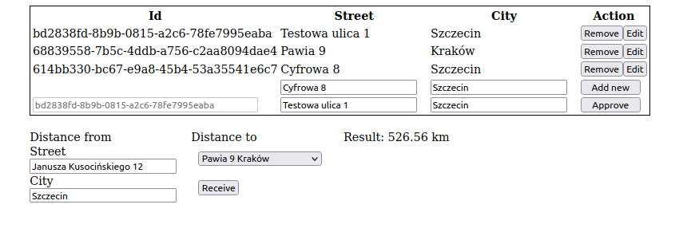

# Locations app
#### Store addresses and calculate distances

[Api endpoints](api/endpoints.md)

## Development
Containers infrastructure:
* api - `php-fpm/mysql/nginx`
* client - `nginx`

[Api intrastructure](api/readme.md)

### How to start
* enter to the project root dir
* `cp api/.secrets.example api/.secrets`
* `bash development/run_containers.sh`

##### Prepare api service:
* enter to the service api dir `cd api`
* prepare database `bash scripts/migrate_database.sh && bash scripts/feed_database.sh`
* build app `bash scripts/build.sh`

##### Running aps:
* Api service - http://localhost:8090
* Client service - http://localhost:8080

### Tests
*  units `./vendor/bin/phpunit tests`

### Code quality tools
* fixer `./vendor/bin/php-cs-fixer fix --allow-risky=yes`
